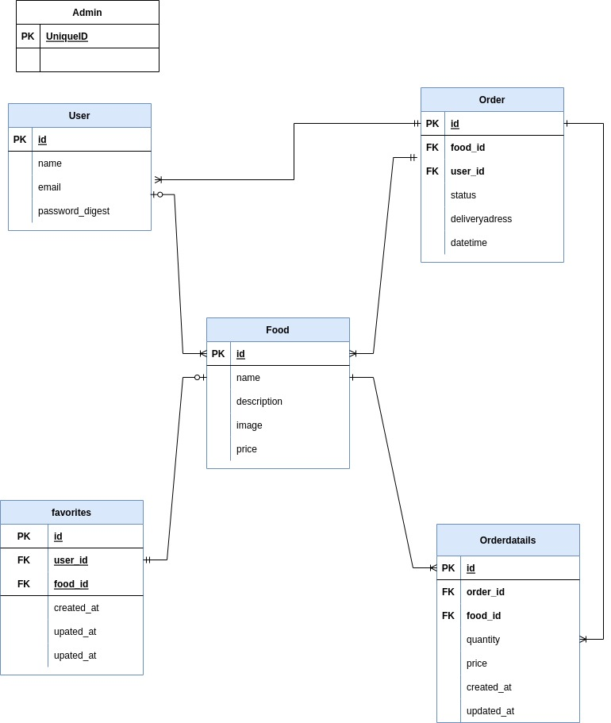
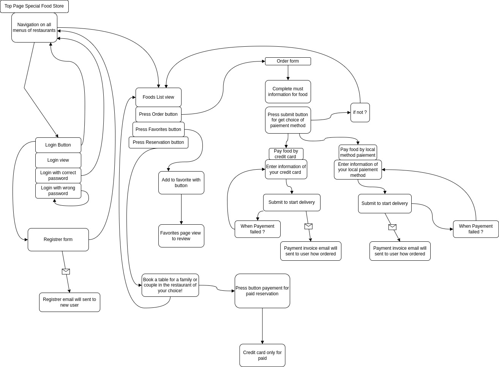

# README

This README would normally document whatever steps are necessary to get the
application up and running.

Things you may want to cover:

Development Language

* Ruby 3.0.1
* Rails 6.0.3

## Employment Term Technology

- Admin Fonction
- User Fonction
- Comment Fonction
- Favorite Fonction
- Email Notification Fonction
- Heroku

## Technology outside the curriculum

- Reservation Fonction
- Payment Fonction
- Localisation Fonction

## Execution Procedure

$ git clone https://github.com/Gado229/special_food_store.git  

$ cd special_food_store  
$ bundle install  
$ rails db:create  
$ rails db:migrate  
$ rails s  
$ rails s -b 0.0.0.0 (Vagrant users)  

## Catalog Design

[Catalog](https://docs.google.com/spreadsheets/d/1d4NybRcYTj6-yHIPUVu6x8xiL-g6nziTM_Ssij9Ozpk/edit?usp=sharing)

## Table Definition Document

[Table](https://docs.google.com/spreadsheets/d/1OI9xIKcnqQ2u9osJxp1DSNf78VppmOSL-Hci0tlWgsk/edit?usp=sharing)

## Wireframe

[Wireframe](https://app.diagrams.net/#G1jhR-_Hi4L4zA_DVm224Sizm7z-KTA5Br)
[Wireframe](./docs/Wire__ER_Diagramm.jpg)

## ER Diagram

[ER Diagram](https://drive.google.com/file/d/1Ue5ZTy0A4AXXlyXMDO01pwizhhFDpMnh/view?usp=sharing)

## Screen Transition Diagram

[Screen Transition](https://drive.google.com/file/d/1KPAUgU9LizMAL9rKoPZSL5PGuEd3M1HT/view?usp=sharing)

