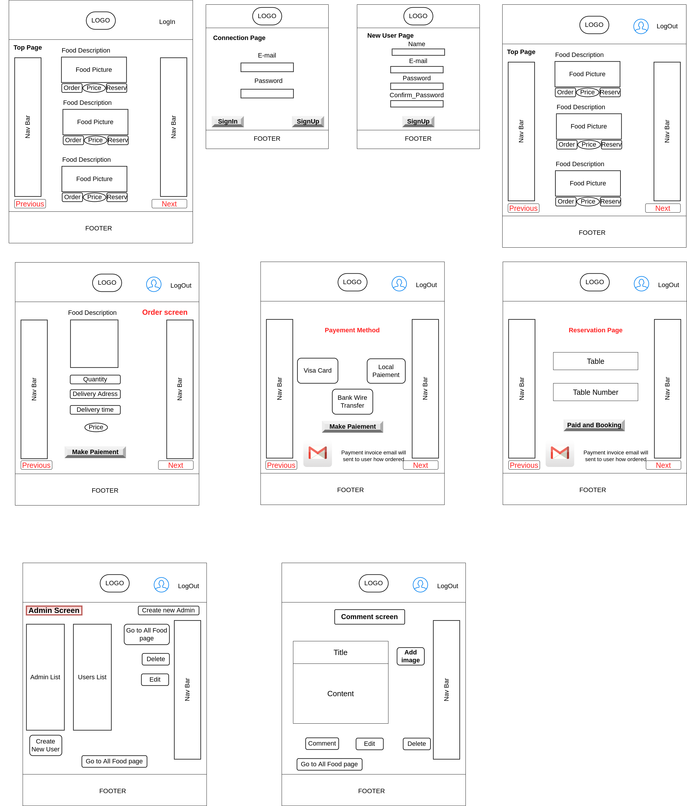
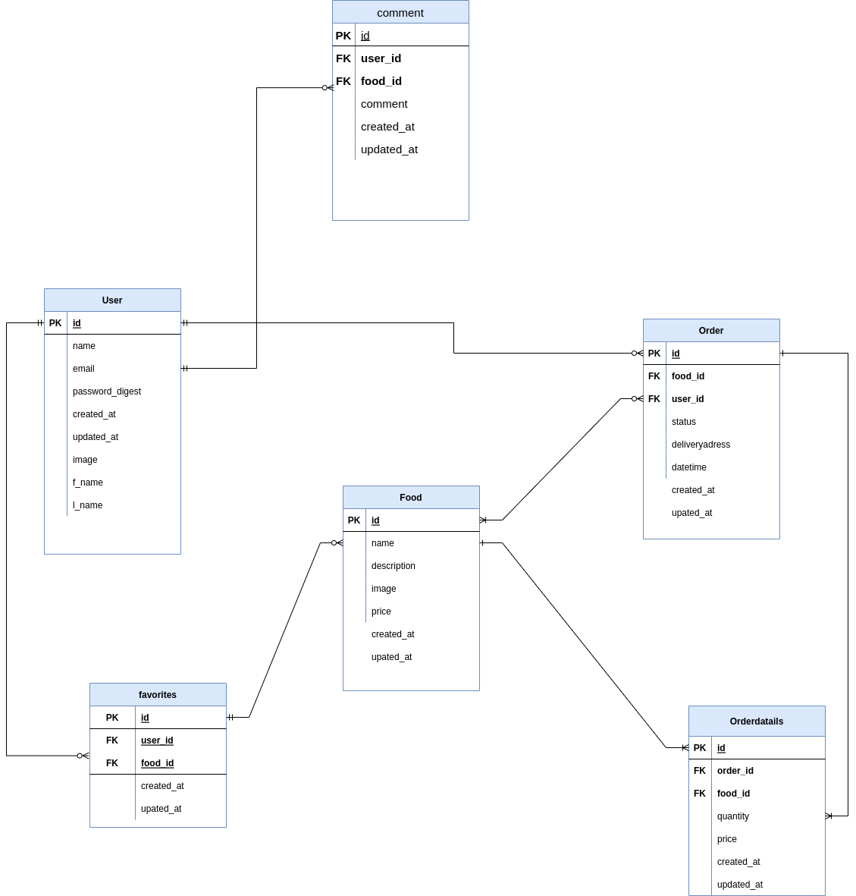

# README

This README would normally document whatever steps are necessary to get the
application up and running.

Things you may want to cover:

Development Language

* Ruby 3.0.1
* Rails 6.0.3

## Employment Term Technology

- devise
- Comment function with Ajax

## Technology outside the curriculum

- Cloudinary

## Execution Procedure

>> $ git clone https://github.com/Gado229/special_food_store.git  
>> $ cd special_food_store  
>> $ bundle install  
>> $ rails db:create  
>> $ rails db:migrate  
>> $ rails s  
>> $ rails s -b 0.0.0.0 (Vagrant users)  

## Check Sheet

[CheckSheet](https://docs.google.com/spreadsheets/d/1rESE5cmB9GxfffT5JE_MwH4rvjPaK02fVPKF3yI_6Zs/edit?usp=sharing)

## Catalog Design

[Catalog](https://docs.google.com/spreadsheets/d/1d4NybRcYTj6-yHIPUVu6x8xiL-g6nziTM_Ssij9Ozpk/edit?usp=sharing)

## Table Definition Document

[Table](https://docs.google.com/spreadsheets/d/1OI9xIKcnqQ2u9osJxp1DSNf78VppmOSL-Hci0tlWgsk/edit?usp=sharing)

## Wireframe

## ER Diagram

[ER Diagram](https://drive.google.com/file/d/1Ue5ZTy0A4AXXlyXMDO01pwizhhFDpMnh/view?usp=sharing)

## Screen Transition Diagram

[Screen Transition](https://drive.google.com/file/d/1KPAUgU9LizMAL9rKoPZSL5PGuEd3M1HT/view?usp=sharing)

